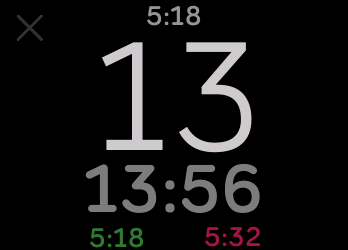

# Timer app for Fitbit Ionic/Versa

Features:
- One finger swipe to select the minutes and start the timer
- Swipe to change timer again within 5 secs of previous timer starting
- Watch lights up 10 seconds before timer is up (if app is open)
- Watch vibrates when timer is up (if app is open)
- Warning dialog if you exit the app while timer running
- Selection bias to make selecting small minutes (1~15) easier than selecting large minutes (30+)
- Timer state saved on shutdown
- Displays current time on top center
- Displays timer start-time and timer end-time at bottom
- Displays remaining minutes and seconds in center
- Direct link to app store (open with phone):
https://gam.fitbit.com/gallery/app/d73ee624-05cf-4ef3-a887-aa8cd1166087
